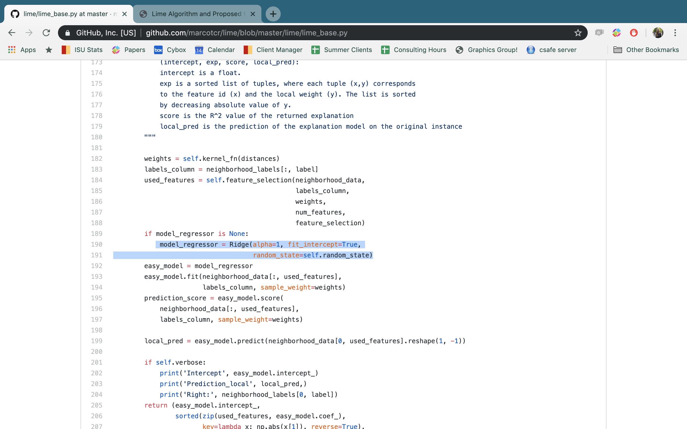

```{r setup, include = FALSE}
knitr::opts_chunk$set(echo = TRUE, 
                      message = FALSE, 
                      warning = FALSE, 
                      eval = TRUE)
```

This journal contains information from the work I did to understand LIME. This includes a description of the LIME procedure from the original paper, a description of the functions in the in the *lime* R package, information about the Python *lime* package, and ideas for new binning methods.

```{r packages and sourced functions}
# Load packages
library(assertthat)
library(cowplot)
library(furrr)
library(future)
library(glmnet)
library(gower)
library(lime)
library(randomForest)
library(tidyverse)

# Source functions
source("../../code/helper_functions.R")
```

# Original Paper {.tabset}

Here, I have copied in the section of the original paper that describes LIME and put it in a more organized format. I have also added in some comments explaining my interpretation of the text and questions where I am not sure what is meant by the text.

### Notation

*Note: Most of the text in this section is copied from the original paper.*

| Notation | Original Paper Definition | My Interpretation (in terms of a data table) |
| -------- | ------------------------- | ------------------------- |
| $x\in\mathbb{R}^d$ | Original representation of an instance being explained | Vector of observed features for one observation e.g. $(x_1, x_2,...,x_d)$ where $\textbf{X}$ is an $n$ by $d$ matrix | 
| $f:\mathbb{R}^d→\mathbb{R}$ | The model being explained...In classification, $f(x)$ is the probability (or a binary indicator) that $x$ belongs to a certain class. | This is a random forest in our case. |
| $x'\in\{0,1\}^{d'}$ | A binary vector for interpretable representation (where interpretable explanations are defined as "use a representation that is understandable by humans") | Varies based on the simulation method used. It is unclear to us how the size of $d$ compares to $d'$. We think they left it vague, so that it could fit any situation ($d<d'$, $d=d'$, or $d>d'$) (One example of converting to an interpretable representation would be a conversion to a vector of indicator variables that indicate whether the observed value falls in the same bin as the instance being explained e.g. $x'_i = I[x_i\in \mbox{same variable } i \mbox{ bin as the instance being explained}]$) | In our example, this is the random forest model. |
|$G$ | A class of potentially interpretable models, such as linear models, decision trees, or falling rule lists |  <span style="color:blue"> I'm not sure what is considered $G$ in the R package - the fitting of the final ridge regression model or the ridge regression model used for feature selection? </span>|
| $g$ | An explanation as a model...can be readily presented to the user with visual or textual artifacts...The domain of $g$ is $\{0,1\}^{d′}$, i.e. $g$ acts over absence/presence of the interpretable components | This could be a ridge regression model with the form $f(x) \sim x'_1 + x'_2 + \cdots + x'_{d'}$ |
| $\Omega(g)$ | A measure of complexity of the explanation $g\in G$. For example, for decision trees $\Omega(g)$ may be the depth of the tree, while for linear models, $\Omega(g)$ may be the number of non-zero weights. | Seemingly, this is based on how the weights are assigned to the data points. |
| $\pi_x(z)$ | A proximity measure between an instance $z$ to $x$, so as to define locality around $x$. | This could be the Gower distance. |
| $\mathcal{L}(f,g,\pi_x)$ | A measure of how unfaithful $g$ is in approximating $f$ in the locality defined by $\pi_x$. | <span style="color:blue"> Does the LIME R package ever consider this? </span> |
| $z'\in\{0,1\}^{d′}$ | A perturbed sample...(which contains a fraction of the nonzero elements of $x′$) | <span style="color:blue"> It appears that they are creating the perturbations in a different way than the R package. </span> |
| $z\in\mathbb{R}^d$ | The sample in the original representation | <span style="color:blue"> Again, this seems to be different than the R package. </span> |
| $f(z)$ | Used as a label for the explanation model | This is the application of the complex model to the perturbed sample. |
| $\mathcal{Z}$ | Data set...of perturbed samples with the associated labels | This is the full simulated dataset of perturbations and complex model predictions. |
| $\xi(x)$ | The explanation produced by LIME...$\underset{g∈G}{\arg\min} \ \mathcal{L}(f,g,\pi_x) + \Omega(g)$ | The output from the explanation model which is found through an optimization process. |

### Goal of LIME

In order to ensure both interpretability and local fidelity, we must minimize $\mathcal{L}(f,g,\pi_x)$ while having $\Omega(g)$ below enough to be interpretable by humans. The explanation produced by LIME is obtained by the following:
  $$\xi(x) = \underset{g∈G}{\arg\min} \ \mathcal{L}(f,g,\pi_x) + \Omega(g)$$
This  formulation  can  be  used  with  different  explanation families $G$, fidelity functions $\mathcal{L}$, and complexity measures $\Omega$. Here we focus on sparse linear models as explanations, and on performing the search using perturbations.

### Procedure

We want to minimize the locality-aware loss $\mathcal{L}(f,g, \pi_x)$ without making any assumptions about $f$, since we want the explainer to be model-agnostic.  

| Step Number | Paper Description | My Interpretation |
| :----: | ----------------- | ----------------- |
| 1 | In order to learn the local behavior of $f$ as the interpretable inputs vary, we approximate $\mathcal{L}(f,g,\pi_x)$ by drawing samples, weighted by $\pi_x$. | <span style="color:blue"> I don't understand how drawing these samples approximates $\mathcal{L}(f,g,\pi_x)$ </span> |
| 2 | We sample instances around $x'$ by drawing nonzero elements of $x'$ uniformly at random (where the number of such draws is also uniformly sampled).| <span style="color:blue"> What is meant by drawing elements of $x'$? Is this different than what the R package is doing? </span> I'm wondering if the idea is that $x'=(x'_1, x'_2,...,x'_{d'})=(1, 1, ...., 1)$, and then a sample is taken such as $z'=(0, x'_2, 0, 0, x'_5,...,x'_{d'}) =(0, 1, 0, 0, 1, ..., 1)$. <span style="color:blue"> However, this doesn't really make sense in terms of why $d'$ is different from $d$ </span> | 
| 3 | Given a perturbed sample $z'\in\{0,1\}^{d′}$ (which contains a fraction of the nonzero elements of $x'$), we recover the sample in the original representation $z\in\mathbb{R}^d$ and obtain $f(z)$, which is used as a label for the explanation model. | <span style="color:blue"> How is the original sample recovered? </span> Maybe based on my example in the last step $z=(0, x_2, 0, 0, x_5, ..., x_d)$|
| 4 | Given this data set $\mathcal{Z}$ of perturbed samples with the associated labels, we optimize $\mathcal{L}(f,g,\pi_x) + \Omega(g)$ to get an explanation $\xi(x)$. | <span style="color:blue"> Where is this done in the R package? </span> | 

It is worth noting that our method is fairly robust to sampling noise since the samples are weighted by $\pi_x$. <span style="color:blue"> Okay - but this will really depend on how $\pi_x$ is chosen </span>

...let $G$ be the class of linear models, such that $g(z′)=w_g\cdot z′$. <span style="color:blue"> (What is $w_g$? Is this suppose to be a linear model where $w_g$ are the coefficients?) </span> We use the locally weighted square loss as $\mathcal{L}$...where we let 
  $$\pi_x(z)=exp(−D(x,z)^2/\sigma^2)$$ 
be an exponential kernel defined on some distance function $D$ (e.g. cosine distance for text, $L2$ distance or images) with width $\sigma$.
  $$\mathcal{L}(f,g,\pi_x)=\sum_{z, z'\in\mathcal{Z}}\pi_x(z)\left(f(z)-g(z')\right)^2$$

### Comment on Faithfulness

...our choice of $G$ (sparse linear models) means that if the underlying model is highly non-linear even in the locality of the prediction, there may not be a faithful explanation.  However, we can estimate the faithfulness of the explanation on $\mathcal{Z}$, and present this information to the user. This estimate of faithfulness can also be used for selecting an appropriate family of explanations from a set of multiple interpretable model classes, thus adapting to the given dataset and the classifier. We leave such exploration for future work, as linear explanations work quite well for multiple black-box models in our experiments.

# Concept Visualizations 

The images in this section were created using simulated data that I knew had a local trend around the point of interest. I consider both a linear regression and a ridge regression as the explainer model.

### Data and Model

This code generates the data and predictions from a hypothetical complex model.

```{r}
# Generate features and predictions from a hypothetical complex model
set.seed(20190624)
lime_data <- data.frame(feature1 = sort(runif(250, 0, 1)),
                        feature2 = sample(x = 1:250, 
                                          size = 250, 
                                          replace = FALSE)) %>%
  mutate(prediction = if_else(feature1 >= 0 & feature1 < 0.1, 
                              (0.3 * feature1) + rnorm(n(), 0, 0.01), 
                      if_else(feature1 >= 0.1 & feature1 < 0.3, 
                              rbeta(n(), 1, 0.5), 
                      if_else(feature1 >= 0.3 & feature1 < 0.5, 
                              sin(pi* feature1) + rnorm(n(), 0, 0.5),
                      if_else(feature1 >= 0.5 & feature1 < 0.8, 
                              -(sin(pi* feature1) + rnorm(n(), 0, 0.1)) + 1,
                      if_else(feature1 >= 0.8 & feature1 < 0.9, 
                              0.5 + runif(n(), -0.5, 0.5), 
                              0.5 + rnorm(n(), 0, 0.3)))))))

# Specify a prediction of interest
prediction_of_interest <- data.frame(feature1 = 0.07, 
                                     feature2 = 200,
                                     prediction = 0.05, 
                                     color = factor("Prediction of Interest"))

# Compute the distance between the prediction of interest and 
# all other observations
lime_data$distance <- (1 - gower_dist(x = prediction_of_interest, 
                                      y = lime_data))^20
```

### Linear Regression Explainer

These visualizations are based on a weighted linear regression model used as the explainer.

```{r}
# Fit the interpretable explainer model (weighted linear regression)
linear_explainer <- lm(formula = prediction ~ feature1 + feature2, 
                       data = lime_data, 
                       weights = distance)

# Extract the coefficients from the explainer
linear_b0 <- coef(linear_explainer)[[1]]
linear_b1 <- coef(linear_explainer)[[2]]
linear_b2 <- coef(linear_explainer)[[3]]

# Predictions versus feature 1
linear_plot_feature1 <- ggplot(data = lime_data,
                        mapping = aes(x = feature1, 
                                      y = prediction, 
                                      size = distance)) + 
  geom_point(color = "grey30",
             alpha = 0.75) + 
  geom_abline(intercept = linear_b0 +
                linear_b2*prediction_of_interest$feature2, 
              slope = linear_b1, 
              size = 1) +
  geom_point(data = prediction_of_interest,
             mapping = aes(x = feature1, y = prediction),
             fill = "#EFB084",
             color = "black",
             size = 5, 
             shape = 23) +
  theme_linedraw(base_family = "Times") +
  labs(x = "Feature 1", 
       y = "Black-Box Prediction") + 
  theme(panel.grid.major = element_blank(), 
        panel.grid.minor = element_blank(),
        axis.text.x = element_blank(),
        axis.ticks.x = element_blank(),
        axis.text.y = element_blank(),
        axis.ticks.y = element_blank(),
        legend.position = "none")

# Predictions versus feature 1
linear_plot_feature2 <- ggplot(data = lime_data,
                        mapping = aes(x = feature2, 
                                      y = prediction, 
                                      size = distance)) + 
  geom_point(color = "grey30",
             alpha = 0.75) + 
  geom_abline(intercept = linear_b0 + 
                linear_b1*prediction_of_interest$feature1,
              slope = linear_b2,
              size = 1) +
  geom_point(data = prediction_of_interest,
             mapping = aes(x = feature2, y = prediction),
             fill = "#EFB084",
             color = "black",
             size = 5, 
             shape = 23) +
  theme_linedraw(base_family = "Times") +
  labs(x = "Feature 2", 
       y = "Black-Box Prediction") + 
  theme(panel.grid.major = element_blank(), 
        panel.grid.minor = element_blank(),
        axis.text.x = element_blank(),
        axis.ticks.x = element_blank(),
        axis.text.y = element_blank(),
        axis.ticks.y = element_blank(),
        legend.position = "none")

# Plot that creates a size legend
size_legend_plot <- lime_data %>%
  gather(key = feature, value = value, 1:2) %>%
  ggplot(mapping = aes(x = value, 
                       y = prediction,
                       size = distance)) + 
  geom_point(color = "grey30",
             alpha = 0.75) +
  labs(size = "Weight") +
  theme_linedraw(base_family = "Times") +
  theme(panel.grid.major = element_blank(), 
        panel.grid.minor = element_blank(),
        axis.text.x = element_blank(),
        axis.ticks.x = element_blank(),
        axis.text.y = element_blank(),
        axis.ticks.y = element_blank())

# Extract the legend
size_legend <- get_legend(size_legend_plot)

# Join the two feature plots
lime_linear_plots <- plot_grid(linear_plot_feature1, 
                               linear_plot_feature2, 
                               size_legend,
                               ncol = 3, 
                               rel_widths = c(0.4, 0.4, 0.1))

# Create a plot to extract a legend for the prediction of interest
lime_legend_plot <- ggplot(data = prediction_of_interest, 
                           mapping = aes(x = feature1, 
                                         y = prediction, 
                                         fill = color)) +
  geom_point(size = 5, shape = 23) +
  scale_fill_manual(values = c("#EFB084")) +
  theme_classic(base_family = "Times") +
  labs(fill = "") +
  theme(legend.position = "bottom")

# Extract the legend
lime_legend <- get_legend(lime_legend_plot)

# Join the title, plots, legend, and caption into one figure
lime_linear_concept <- plot_grid(lime_linear_plots, lime_legend,
                         ncol = 1,
                         rel_heights = c(0.9, 0.1))
```

This example shows that the explainer model is doing a good job of capturing the local trend.

```{r}
# View the plot
lime_linear_concept
```

### Ridge Regression Explainer

```{r}
# Fits the explainer model (weighted ridge regression)
ridge_explainer <- glmnet(x = lime_data %>% 
                            select(feature1, feature2) %>%
                            as.matrix(), 
                          y = lime_data %>% pull(prediction),
                          weights = lime_data$distance,
                          family = "gaussian", 
                          alpha = 0, 
                          lambda = 1, 
                          standardize = FALSE)

# Extract the coefficients from the explainer
ridge_b0 <- ridge_explainer$a0[[1]]
ridge_b1 <- ridge_explainer$beta[1,1]
ridge_b2 <- ridge_explainer$beta[2,1]

# Predictions versus feature 1
ridge_plot_feature1 <- ggplot(data = lime_data,
                        mapping = aes(x = feature1, 
                                      y = prediction, 
                                      size = distance)) + 
  geom_point(color = "grey30",
             alpha = 0.75) + 
  geom_abline(intercept = ridge_b0 +
                ridge_b2*prediction_of_interest$feature2, 
              slope = ridge_b1, 
              size = 1) +
  geom_point(data = prediction_of_interest,
             mapping = aes(x = feature1, y = prediction),
             fill = "#EFB084",
             color = "black",
             size = 5, 
             shape = 23) +
  theme_linedraw(base_family = "Times") +
  labs(x = "Feature 1", 
       y = "Black-Box Prediction") + 
  theme(panel.grid.major = element_blank(), 
        panel.grid.minor = element_blank(),
        axis.text.x = element_blank(),
        axis.ticks.x = element_blank(),
        axis.text.y = element_blank(),
        axis.ticks.y = element_blank(),
        legend.position = "none")

# Predictions versus feature 2
ridge_plot_feature2 <- ggplot(data = lime_data,
                        mapping = aes(x = feature2, 
                                      y = prediction, 
                                      size = distance)) + 
  geom_point(color = "grey30",
             alpha = 0.75) + 
  geom_abline(intercept = ridge_b0 + 
                ridge_b1*prediction_of_interest$feature1,
              slope = ridge_b2,
              size = 1) +
  geom_point(data = prediction_of_interest,
             mapping = aes(x = feature2, y = prediction),
             fill = "#EFB084",
             color = "black",
             size = 5, 
             shape = 23) +
  theme_linedraw(base_family = "Times") +
  labs(x = "Feature 2", 
       y = "Black-Box Prediction") + 
  theme(panel.grid.major = element_blank(), 
        panel.grid.minor = element_blank(),
        axis.text.x = element_blank(),
        axis.ticks.x = element_blank(),
        axis.text.y = element_blank(),
        axis.ticks.y = element_blank(),
        legend.position = "none")

# Join the two feature plots
lime_ridge_plots <- plot_grid(ridge_plot_feature1, 
                              ridge_plot_feature2, 
                              size_legend,
                              ncol = 3,
                              rel_widths = c(0.4, 0.4, 0.1))

# Join the title, plots, legend, and caption into one figure
lime_ridge_concept <- plot_grid(lime_ridge_plots, 
                                lime_legend,
                                ncol = 1,
                                rel_heights = c(0.9, 0.1))
```

This example shows that the explainer model is **not** doing a good job of capturing the local trend.

```{r}
# Preview the plot
lime_ridge_concept
```

# R Package 

This section describes the procedure the the *lime* R package implements. The version of the `lime` package that is considered here is `r packageVersion("lime")`. The version considered when I first wrote this section was 0.5.0. I am only considering the `data.frame` versions of the functions. In order to determine if any of the functions that I am interested in have changed since I wrote the description, I created the function below that allows me to check if anything has changed in the function. If nothing has changed, it then prints the function.

```{r}
# Function for checking for changes in a function and printing the current version
func_check <- function(func_name, version){
  
  # Specify the path to where the function will be stored
  file_path <- paste0("../../../data/lime_functions/", func_name, "_v", version, ".rds")
  
  # Save the file if it does not exist, otherwise load the function and check 
  # to make sure they have been no changes
  if(!file.exists(file_path)) {
    saveRDS(object = getAnywhere(func_name), file = file_path)
  } else {
    saved_func <- readRDS(file_path)
    assertthat::assert_that(assertthat::are_equal(saved_func,
                                                  getAnywhere(func_name)))
  }
  
  # Print the function
  getAnywhere(func_name)

}
```

## Main Functions

### `lime.data.frame` {.tabset}

#### Inputs

- `x`: The training data used to fit the model to be explained
- `model`: The model to explain.
- `preprocess = NULL`: Function to transform a character vector to the format expected from the model.
- `bin_continuous = TRUE`: If set to `TRUE`, the continuous variables will be binned when making the explanations. If they are not binned, then perturbations will be obtained by either simulating using kernel density estimation or a normal distribution depending on what the option of `use_density` is set to.
- `n_bins = 4`: The number of bins to use if `bin_continuous = TRUE`.
- `quantile_bins = TRUE`: Should quantile bins be used if `bin_continuous = TRUE? (Otherwise, equally spaced bins will be used.)
- `use_density = TRUE`: This option is only considered if `bin_continuous` is set to `FALSE`. In that situation, if `use_density = TRUE`, then the continuous data will be sampled using kernel density estimation. Otherwise, it will be assumed that the continuous features follow a normal distribution and samples will be drawn from a normal distribution with the mean and standard deviation set to the sample mean and standard deviation associated with the feature.

#### Procedure

1. If `preprocess` is NULL, then set it to the identity function. Either way, check to make sure that it is a function.
2. Create an explainer object.
3. Determine the type of each of the features (e.g. integer, numeric, etc.). If any of the variables are constants, a warning is returned. If the feature type is unknown, an error is returned.
4. Create bins for numeric and inter type variables. If `quantile_bins = TRUE`, then `n_bins` bins are created using quantiles. Otherwise, `n_bins` equally spaced bins are created. If `quantile_bins = TRUE` and `n_bins` < 3, then a warning is produced ("does not contain enough variance to use quantile binning. Using standard binning instead.") and `n_bins` equally spaced bins are returned.
5. Determine the "distribution" for each feature. The method used is based on the type of variable. 
    - Integer: nothing
    - Numeric: If `bin_continuous`, then determine the
    proportion of observations in each bin. If
    `use_density=TRUE`, then kernel a kernel density
    approximation is used to estimate the distribution.
    Otherwise, the mean and standard deviation of each 
    of the features is computed.
    - Character: nothing
    - Logical: nothing
    - Factor: Determine the proportion in each category.
6. Assign some attributes to the explainer object, and return the explainer object.

#### Function

```{r}
# Print the lime function (and check to see if there have been any changes)
func_check("lime.data.frame", "0.5.0")
```

### `explain.data.frame` {.tabset}

#### Inputs

- `x`: The new observations to explain (with the same format as used when creating the explainer).
- `explainer`: This is the object output from the `lime` function.
- `labels = NULL`: The specific labels (classes) to explain in case the model is a classifier. For classifiers either this or `n_labels` must be given.
- `n_labels = NULL`: The number of labels to explain. If this is given for classifiers, the top `n_label` classes will be explained.
- `n_features`: The number of features to use for each explanation. (i.e. The number of features to select during feature selection.)
- `n_permutations = 5000`: The number of perturbations generated for each feature.
- `feature_select = 'auto'`: This is the feature selection method for choosing the number of features specified. 
    - `auto`: If `n_features` $\le 6$, uses `forward_selection`.
    Otherwise, `highest_weights` is used. 
    - `none`: Use all features for the explanation. Not advised
    unless you have very few features.
    - `forward_selection`: Add one feature at a time until
    `n_features` is reached, based on quality of a ridge 
    regression model.
    - `highest_weights`: The `n_features` with highest absolute
    weight in a ridge regression fit of the complex model outcome
    are chosen.
    - `lasso_path`: Fit a lasso model and choose the `n_features`
    whose lars path converge to zero the latest.
    - `tree`: Fit a tree to select `n_features` (which needs to be
    a power of 2). It requires last version of *XGBoost*.
- `dist_fun = 'gower'`: The distance function to use for calculating the distance from the observation to the permutations. If `dist_fun = 'gower'` (default) it will use `gower::gower_dist()`. Otherwise it will be forwarded to `stats::dist()`.
- `kernel_width = NULL`:The width of the exponential kernel that will be used to convert the distance to a similarity in case `dist_fun != 'gower'`.
- `gower_pow = 1`: A modifier for gower distance. The calculated distance will be raised to the power of this value.

#### Procedure

1. Check to make sure that `explainer` is an object output from the `lime` function. 

        assertthat::assert_that(is.data_frame_explainer(explainer))

2. Determine the type of the model that is contained within the explainer function (using the [`model_type`](#model_type) function), and determine the type of output that should be produced by `explain` based on the model type (using the [`output_type`](#output_type) function).

        m_type <- model_type(explainer)  
        o_type <- output_type(explainer)

3. If the model type is regression, check to make sure both `labels` and `n_labels` are set to NULL. Otherwise, return a warning saying that labels and n_labels are ignored with explaining regression models. Then set `n_lables` to 1 and `labels` to NULL.

        if (m_type == "regression") {
          if (!is.null(labels) || !is.null(n_labels)) {
            warning("\"labels\" and \"n_labels\" arguments are ignored 
              when explaining regression models")
          }
          n_labels <- 1
          labels <- NULL
        }

4. Check to make sure that only `labels` or `n_labels` is specified and the other is NULL. If not, output a warning saying that you must choose between one or the other.

        assert_that(is.null(labels) + is.null(n_labels) == 1, 
          msg = "You need to choose between labels and n_labels parameters.")
        
5. Return an error if `n_features` or `n_permutations` are not specified as counts.

        assert_that(is.count(n_features))
        assert_that(is.count(n_permutations))

6. If the kernel width has not been specified, then compute it as the square root of the number of columns of the testing dataframe multiplied by 0.75. Then create a kernel function that will be used to weight the perturbations based on the specified kernel width using the function [`exp_kernel`](#exp_kernel). The formula used by `exp_kernel` is
  $$f(x, w)=\sqrt{\exp\left(\frac{-(x^2)}{w}\right)}$$
where $w$ is the kernel width.

        if (is.null(kernel_width)) {
          kernel_width <- sqrt(ncol(x)) * 0.75
        }
        kernel <- exp_kernel(kernel_width)

7. Makes use of the [`permute_cases`](#permute_cases) function for data frames in the lime package. This is the function that creates the perturbations. One perturbation is created for each of the `n_permuations` specified.

        case_perm <- permute_cases(x, n_permutations, explainer$feature_distribution, 
          explainer$bin_continuous, explainer$bin_cuts, explainer$use_density)

--------- 

- Predictions for the testing data using the random forest model are computed.
     + The random forest model `rtrees` is used to make a prediction for the observation from the test dataset and each of the $n=5000$ samples as to whether or not the comparison of the two bullets in the test case are a match. Since the random forest is a classification model, `lime` is set to return the prediction probabilities.

- Similarity score between the observation in the testing data and each of the $n=5000$ sampled values are obtained.
    + The way that the similarity score is computed depends on the type of feature. Since all of the features in the Hamby 224 test dataset are continuous, the simulated values are first converted into 0-1 features where a 1 indicates that the feature from the simulated value falls in the same bin as the observed data point and a 0 indicates that the feature is not in the same bin as the observed data point. Then, by default, the Gower distance is used to compute the similarity score. (using the `gower` package in R)

- Feature selection is performed by fitting some type of regression model weighted by the similarity scores is to the simulated data and the observed value. The 0-1 versions of the features are used.
    + The user can specify the number of features, $m$, they would like to select to explain the prediction. `lime` supports the following options for feature selection
      * forward selection with ridge regression
      * highest weight with ridge regression
      * LASSO model
      * tree model
      * default: forward selection if $m\le6$ with a ridge regression model, highest weight with ridge regression otherwise

- A ridge regression model is fit as the simple model by regressing the prediction probabilities on the $m$ selected predictor variables and weighted by the similarity scores. If the response is categorical, the user can select how many categories and which categories they want to explain.
  $$P(Match = TRUE) = \beta_0 + 
  \beta_1 \cdot I\left[X_1 \in \mbox{obs bin}\right] + 
  \beta_2 \cdot I\left[X_2 \in \mbox{obs bin}\right] + 
  \beta_3 \cdot I\left[X_3 \in \mbox{obs bin}\right]$$
For the prediction of interest, 
  $$P(Match = TRUE) = \beta_0 + \beta_1 + \beta_2 + \beta_3.$$
- The feature weights are extracted and used as the explanations.

Note: I realized that if `bin_continuous = FALSE`, then bins are not used at all. Instead, a kernel density estimator is used to sample from the distribution (or a normal distribution if specified), and then the ridge regression models are fit without "numerified" values.

#### Function

```{r}
# Print the explain function (and check to see if there have been any changes)
func_check("explain.data.frame", "0.5.0")
```

## Helper Functions

### `model_type` {#model_type .tabset}

#### Info

The *lime* package provides a variety of functions for extracting the model type from the complex model to be explained. The function `model_type` is an overarching function that leads to the specific functions for determining the model type. The specific functions vary based on what package was used to fit the model. 

Here is information from the package documentation about models supported by *lime*. 

    Out of the box, lime supports the following model objects:
      - train from caret
      - WrappedModel from mlr
      - xgb.Booster from xgboost
      - H2OModel from h2o
      - keras.engine.training.Model from keras
      - lda from MASS (used for low-dependency examples)
    If your model is not one of the above you'll need to implement support yourself. If the model has a predict interface mimicking that of predict.train() from caret, it will be enough to wrap your model in as_classifier()/as_regressor() to gain support. Otherwise you'll need need to implement a predict_model() method and potentially a model_type() method (if the latter is omitted the model should be wrapped in as_classifier()/as_regressor(), everytime it is used in lime()).

#### Function

```{r}
getAnywhere(model_type)
```

#### Model Specific Functions

```{r}
getAnywhere(model_type)
getAnywhere(model_type.default)
getAnywhere(model_type.lime_classifier)
getAnywhere(model_type.lime_regressor)
getAnywhere(model_type.train)
getAnywhere(model_type.model_fit)
getAnywhere(model_type.WrappedModel)
getAnywhere(model_type.xgb.Booster)
getAnywhere(model_type.lda)
getAnywhere(model_type.keras.engine.training.Model)
getAnywhere(model_type.H2OModel)
getAnywhere(model_type.ranger)
```

### `output_type` {#output_type .tabset}

#### Inputs

- `x`: the model that is stored in the `explainer` object

#### Procedure 

1. Identifies which model type the model is. If it is a classification model, then the output type is set to "prob". If it is a regression model, then the output type is set to "raw". If neither of these, then an error is returned saying that the model type that was input is not supported by the package.

        switch(model_type(x), 
              classification = "prob", 
              regression = "raw", 
              stop(model_type(x), " models are not supported yet", call. = FALSE))

#### Function

```{r}
# Print the explain function (and check to see if there have been any changes)
func_check("output_type", "0.5.0")
```

### `exp_kernel` {#exp_kernel .tabset}

#### Inputs

- `width`: kernel width

#### Procedure

1. Create a function for computing an exponential kernel.

        function(x) sqrt(exp(-(x^2)/(width^2))) 
        
#### Function

```{r exp_kernel}
# Print the exp_kernel function (and check to see if there have been any changes)
if(!file.exists("../../../data/lime_functions/exp_kernel_v0.5.0.rds")) {
  saveRDS(object = getAnywhere(exp_kernel),
          file = "../../../data/lime_functions/exp_kernel_v0.5.0.rds")
  getAnywhere(exp_kernel)
} else {
  exp_kernel_v0.5.0 <- readRDS("../../../data/lime_functions/exp_kernel_v0.5.0.rds")  
  if(assert_that(are_equal(exp_kernel_v0.5.0, getAnywhere(exp_kernel)))){
    getAnywhere(exp_kernel)
  } 
}
```

### `permute_cases` {#permute_cases .tabset}

#### Inputs

#### Procedure

1. Compute the number of rows as the number of predictions to be explained times the number of permutations.

        nrows <- nrow(cases) * n_permutations

2. Create the perturbations based on the type of variable and using the feature distribution determined by the lime function. The cases are as follows.
    - numeric variable and the feature distribution contains all NAs: the observed cases get repeated `n_permutations` times
    - numeric variable and `bin_continuous = TRUE`: 
    sample from 1:number of bin cuts with replacement for
    nrows times using the probability from the variable 
    distribution sample from a uniform(0,1) distribution
    and then multiply by the difference in bin cuts of
    the appropriate bin and add the quantile associated
    with the bin
    - numeric variable, `bin_continuous = FALSE`, and `use_density = TRUE`: 
    - numeric variable, `bin_continuous = FALSE`, and `use_density = FALSE`: randomly sample from a normal distribution, multiply by the sd of the feature distribution, and add the mean 
    - character variable: sample from the names of the levels in the variable based on the probability of the variable distribution
    - logical variable: 
    - factor variable: sample from the names of the levels in the variable based on the probability of the variable distribution and convert the samples to factors 
    - date: 
    - integer variable: round the permutations to the nearest integer
3. Give the permutations the same name as the variables
4. Add the cases back into the data frame of the permutations
5. Return the permutations.
  
#### Function

```{r}
if(!file.exists("../../../data/lime_functions/permute_cases_v0.5.0.rds")) {
  saveRDS(object = getAnywhere(permute_cases.data.frame),
          file = "../../../data/lime_functions/permute_cases_v0.5.0.rds")
  getAnywhere(permute_cases.data.frame)
} else {
  permute_cases_v0.5.0 <- readRDS("../../../data/lime_functions/permute_cases_v0.5.0.rds")  
  if(assert_that(are_equal(permute_cases_v0.5.0, getAnywhere(permute_cases.data.frame)))){
    getAnywhere(permute_cases.data.frame)
  } 
}
```

# Python Package

I have not spent a lot of time going through the Python package code, but I wanted to check to see if it uses a ridge regression for the feature selection and the explainer model. This [article](https://towardsdatascience.com/how-to-perform-lasso-and-ridge-regression-in-python-3b3b75541ad8) describes that ridge regression can be fit in Python using the sklearn "package". These images below of the code from the Python lime [GitHub repository](https://github.com/marcotcr/lime/blob/master/lime/lime_base.py) seem to imply that it is using ridge regression for both of these steps.




# Proposed Bin Creation Methods

### The Data

The cleaning training and testing datasets are loaded in below.

```{r}
# Load in the training data (Hamby Data 173 and 252)
hamby173and252_train <- read.csv("../../../data/hamby173and252_train.csv")
```

### Subsampled Bins

One idea that I had to try to improve the lime explanations was to subsample from the training dataset before computing the quantiles. The proportion of observations with `samesource = FALSE` is very large in the training dataset, so that overwhelms the observations with `samesource = TRUE`. By subsampling, it might allow for better locations to bin the data. I wrote the code below to attempt to apply lime to a subsampled version of the training dataset.

```{r eval = FALSE}
# Code saved for future use for the sampling data

# Create the data (with a set seed)
set.seed(20181128)
hamby173and252_train_sub <- hamby173and252_train %>%
  filter(samesource == FALSE) %>%
  slice(sample(1:length(hamby173and252_train$barrel1), 4500, replace = FALSE)) %>%
  bind_rows(hamby173and252_train %>% filter(samesource == TRUE))

# Save the subsampled data
write.csv(hamby173and252_train_sub, "../../data/hamby173and252_train_sub.csv", row.names = FALSE)

# Apply lime to the subsampled training data with the specified input options
hamby224_lime_explain_sub <- future_pmap(.l = as.list(hamby224_lime_inputs %>%
                                                        select(-case)),
                                         .f = run_lime, # run_lime is one of my helper functions
                                         train = hamby173and252_train_sub %>% select(rf_features),
                                         test = hamby224_test %>% arrange(case) %>% select(rf_features) %>% na.omit(),
                                         rfmodel = as_classifier(rtrees),
                                         label = "TRUE",
                                         nfeatures = 3,
                                         seed = TRUE) %>%
  mutate(training_data = factor("Subsampled"))

# Separate the lime and explain function results from the subsampled data
hamby224_lime_sub <- map(hamby224_lime_explain_sub, function(list) list$lime)
hamby224_explain_sub <- map_df(hamby224_lime_explain_sub, function(list) list$explain)

# Join the lime results from the full and subsampled training data
hamby224_lime <- c(hamby224_lime_full, hamby224_lime_sub)
hamby224_explain <- bind_rows(hamby224_explain_full, hamby224_explain_sub)
```

### Tree Based Bins

Heike suggested the idea of using classification trees to choose the cutoffs for the lime bins. That is, the divisions in the tree could be used as the bin cuts. This would allow us to automate the process and to obtain a penalty parameter since the trees give us nesting. (MSE + lambda * p where p is the from the number of trees multiplied by the number of ...)

Heike wrote the function `treebink` to take x and y variables for fitting a tree and returning the cuts for $k$ bins based on the splits from the tree. The function is stored in the file   `helper_functions.R`. Here is an example using the function below with the predictor variable of ccf.

```{r}
# Example using treebink
treebink(y = hamby173and252_train$samesource, x = hamby173and252_train$ccf, k = 5)
```

However, there seems to be a problem with `treebink`. For certain variables, when a high number of bins is requested, the function returns more than the desired number of bins. Heike is going to look into this.

She recently updated the function `treebink` to run using the tree package. Here are some comments from her about the code: 

"I've moved it from rpart to tree. I am not quite sure that the two packages are doing the exact same thing. They claim they do but they might be implemented a bit differently. What we are doing now is if there are too many splits, we look at the order in which the splits are made and roll back some of them. I haven't found a case that doesn't work, but obviously that doesn't show that there isn't any :)"

I wrote the function `mylime`, which adds an option in the `lime` function from the LIME package to use Heike's function `treebink` to obtain tree based bins. This function is also included in the file `helper_functions.R`. The output from `mylime` can then be input into the `explain` function to obtain explanations. I was able to rerun all of the code for creating the `hamby224_test_explain` dataset with the explanations from the tree based bins included for 2 to 6 bins.

# Session Info

```{r}
sessionInfo()
```