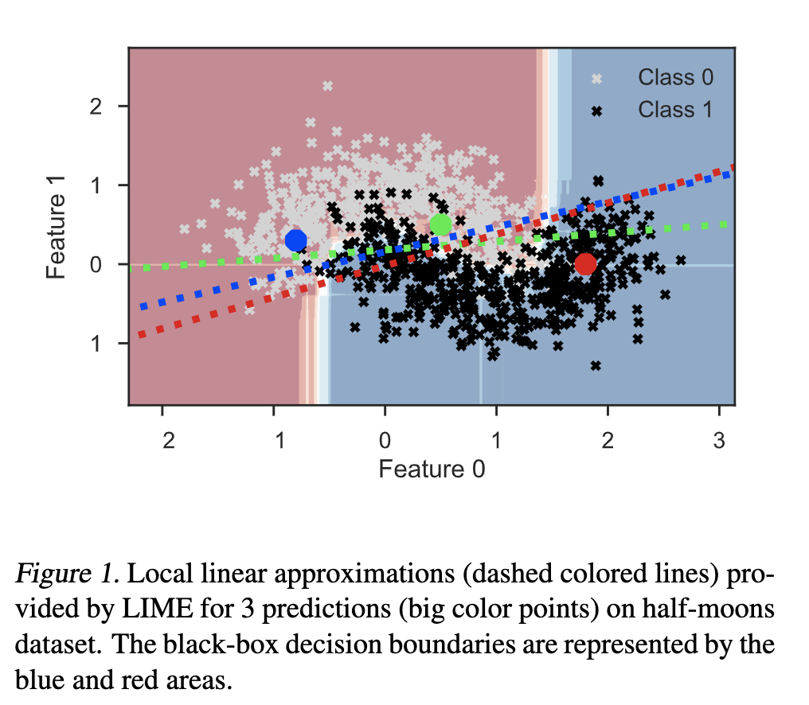
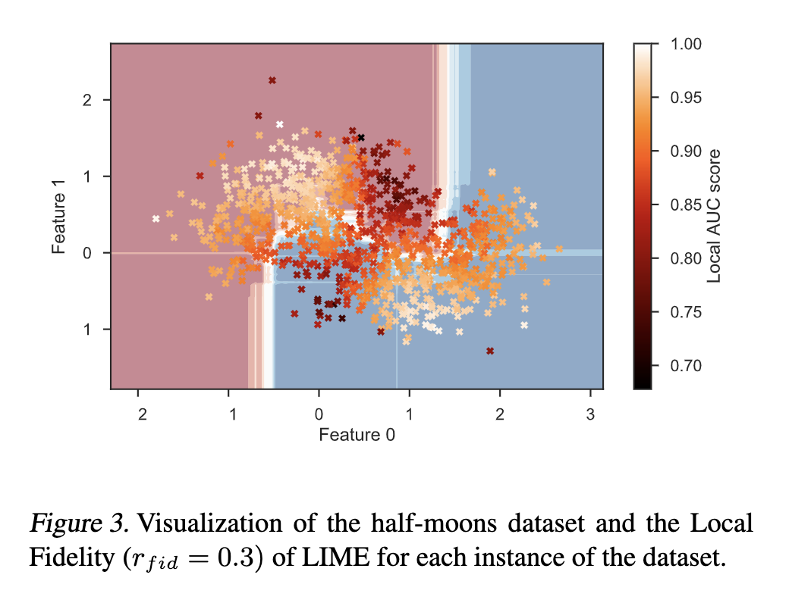

```{r setup, include=FALSE}
knitr::opts_chunk$set(echo = TRUE)
```

# Overview

This journal contains some information on papers relating to LIME.

# Locality Assumption

I'm finding that I am not the only person discovering issues with the local assumption made by LIME.

### Laugel et al (2018)

***Defining Locality for Surrogates in Post-hoc Interpretablity***

This paper is interested in "the importance of defining the right locality, the neighborhood on which a local sur-rogate is trained, in order to approximate accurately the local black-box decision boundary." They propose a new method for sampling around the pertrubations that is not necessarily centered at the prediction of interest.

**Notation** 

| notation | definition | 
| -------- | ---------------------- |
| $\mathcal{X}$ | feature space |
| $b:\mathcal{X}\rightarrow\mathcal{Y}$ | black-box classifier | 
| $b(x)$ | prediction made by $b$ where $x\in\mathcal{X}$ | 
| $X$ | training set used to train $b$ |
| $s_x$ | surrogate model that can approximate the local decision boundary of $b$ from which explanations are extracted | 
| $X_{s_x}$ | training set sampled from the feature space | 
| $Y_{s_x}$ | "labels" associated with $X_{s_x}$ and computed as $Y_{s_x}=b(X_{s_x})$ | 
| $\mathcal{V}_x$ | neighborhood around $x$ | 
| $Acc$ | a measure of accuracy (such as the AUC score) |
| $LocalFid(x, s_x)$ | measure of local fidelity of $s_x$ to $b$ | | $r_{fid}$ | radius of the fidelity hypersphere used when determining the neighborhood $\mathcal{V}_x$ |
| $x_{border}$ | the closest decision boundary of $b$ to $x$ (determined as $b(x_{border})\not=b(x)$) |
| $\mathcal{S}$ | hypersphere used to sample training instances in LS procedure | 
| $r_{s_x}$ | radius of $\mathcal{S}$ |

**Steps in a Surrogate Model Explanation**

1. "Sample the feature space to generate a training set"
2. "A surrogate model can be fit using [the training set] in order to approximate the local decision boundary of $b$" (the surrogate can be adjusted for complexity and locality)
3. "Explanations are extracted from the surrogate $s_x$"

**Comments Relating to LIME**

- It appears that they only consider the normal approximation sampling method used by LIME ("Regarding the sampling step (1), a set of instances $X_{s_x}$ is drawn following a normal distribution with the same mean and standard  deviation  as  the  original  feature  space $\mathcal{X}$, independently from the instance $x$ of the prediction $b(x)$ to explain.")
- They also mention that LIME uses ridge regression
- The figure below shows the paper's conceptual depiction of LIME where the linear decision boundaries are based on a label of 0.5. That is
  $$s_x(a)=0.5=\hat{\beta}_0+\hat{\beta}_1\mbox{F0}+\hat{\beta}_2\mbox{F1} \ \ \ \Rightarrow \ \ \  \mbox{F1}=\left(\frac{0.5-\hat{\beta}_0}{\hat{\beta}_2}\right)-\left(\frac{\hat{\beta}_1}{\hat{\beta}_2}\right)\mbox{F0}=\hat{\alpha}_0+\hat{\alpha}_2\mbox{F0}$$
- The figure shows how the decision boundaries are not good local approximations.



**Proposed Locality Metric**

The authors propose the following definition for *Local Fidelity* as "the fidelity of $s_x$ to $b$ withing a neighborhood $\mathcal{V}_x$ around $x$ as
  $$LocalFid(x,s_x)=Acc_{x_i\in\mathcal{V}_x}(b(x_i), s_x(x_i))$$
where $Acc$ is a measure of accuracy (such as the AUC score) calculated over instances generated uniformly in $\mathcal{V}_x$." 
*Note: This is similar to the locality metric proposed in the original paper. Again, it is comparing the black-box model prediction to the explainer model prediction.*

They define the $\mathcal{V}_x$ of $x$ using a $l_2$-hypersphere of radius $r_{f_{id}}$ centered on $x$. They say, "This intuitive definition of locality allows us to make the radius $r_{fid}$ of the fidelity hypersphere a proxy for the degree of locality considered. Since the radius value is heavily linked to the dimension and density of the input space $\mathcal{X}$,$r_{fid}$ will be expressed in the rest of the paper as a percentage of the maximum distance between the instances of the dataset andv $x$, whose prediction is being interpreted." <span style="color:blue"> I don't really understand their definition of $r_{fid}$. </span>

You can also compute this value for all observations in a dataset and then compute the mean and standard deviation to get a feel for how the local fidelity compares across the whole dataset.

The figure below shows their locality metric computed for a specific $r_{fid}$ <span style="color:blue"> (they do not explain how they chose this value) </span>. The image shows that LIME has a more difficult time with the local approximation in the regions where a local approximation is more important. They say, "LIME has trouble approximating areas where the local decision boundary of the black-box classifier $b$ differs from the decision boundary approximating the whole dataset (ie.features with a local influence vs. features with a global influence)."



**Proposed Local Surrogate (LS) Sampling Method**

The general idea is that instead of sampling across the whole feature space and then weighting the samples, a local region containing the closest decision boundary will be found and samples will only be drawn in this region.

Steps:

1. Detect the closest decision boundary of $b$ by looking for the closest instance $x_{border}$ such that $b(x_{border})\not=b(x)$. (Done using the *GrowingSpheres* (Laugel et al, 2018) algorithm.)
2. Sample training instances uniformly in a hypersphere $\mathcal{S}$ of radius $r_{s_x}$ centered on $x_{border}$. <span style="color:blue"> How will the radius be determined? </span>
3. Fit $s_x$ to this new data, which to learn the closest decision border to $x$.

*Comment: I feel like this will only work well if there is an observation from the other class "close" to the case of interest.*

**References to Look Into**

- Craven and Shavlik (1996): show that "increasing the density of instances is beneficial for the surrogate accuracy"
- Hara and Hayashi (2016): general info on surrogate models

# Other Explainer Models

### LORE (LOcal Rule-based Explanations)

This section contains my notes from reading through the paper introduction [LORE](https://arxiv.org/pdf/1805.10820.pdf). 

Same idea as LIME: whole decision boundary is complex, but simpler at a local level

Difference from LIME:

(1) obtain the local data in a different way from LIME using a "genetic algorithm"
(2) better explainations (they claim)

## Method

Notation from the paper: 

- $b$ = black blox predictor
- $x$ = specific instance in the data
- $y$ = predicted value from $b$ given $x$
- $c$ = interpretable predictor (a decision tree)
- $N$ = number of neighbor instances of $x$ generated using a "genetic algorithm"
- $r$ = the single rule that is a part of the local explanation
- $\Phi$ = the counterfactual rules that are a part of the local explanation
- $Z$ = generated instances with characteristics close to the ones of $x$ (note that $Z=Z_{=}\cup Z_{\not=}$)
- $Z_=$ = set of instances $z\in Z$ where $b(z)=b(x)$ 
- $Z_{\not=}$ =  set of instances $z\in Z$ where $b(z)\not=b(x)$ 

General Idea:

- generate neighboring instances ($Z$) to $x$ using a genetic algorithm
- fit a tree to $Z$ called $c$
- obtain the local explainer $r$ by extracting the path from the decision tree $c$ that leads to $y$ with the same conditions as $x$
- obtain the counterfactual rules $\Phi$ using the other paths from the decision tree $c$

Genetic Algorithm: Makes use of fitness functions

Fitness function = A fitness function is a particular type of objective function that is used to summarise, as a single figure of merit, how close a given design solution is to achieving the set aims. Fitness functions are used in genetic programming and genetic algorithms to guide simulations towards optimal design solutions. (from Wikipedia)

# Session Info

```{r}
sessionInfo()
```
